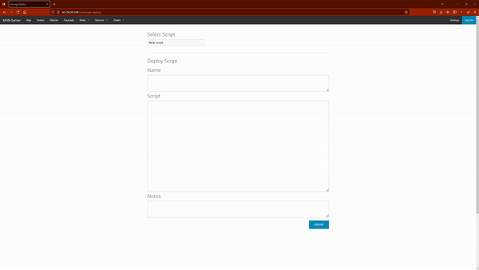
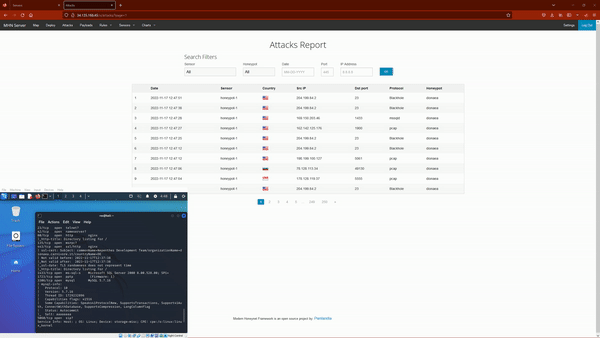
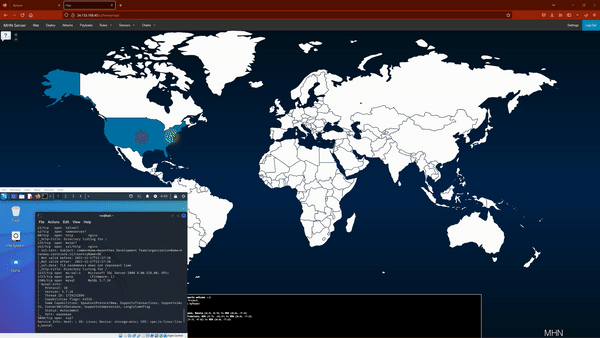

# Honeypot Assignment

**Time spent:** **12** hours spent in total

**Objective:** Create a honeynet using MHN-Admin. Present your findings as if you were requested to give a brief report of the current state of Internet security. Assume that your audience is a current employer who is questioning why the company should allocate anymore resources to the IT security team.

### MHN-Admin Deployment (Required)

**Summary:** MNH-Admin Deployment was done with GCP by configuring firewall rules and establishing SSH access to the VM via the cloud platform.

### Dionaea Honeypot Deployment (Required)

**Summary:** Named after the venus flytrap, Dionaea is a honeypot that captures incoming attack payloads and malware. It emulates a vulnerable Windows environment and captures information on malware used to exploit systems.

### Database Backup (Required) 

**Summary:** The information in the session.json file includes timestamps, src IPs, destination and source ports.

*Be sure to upload session.json directly to this GitHub repo/branch in order to get full credit.*

## Notes

Was a bit confusing when certain terminals decide to deny permissions.
