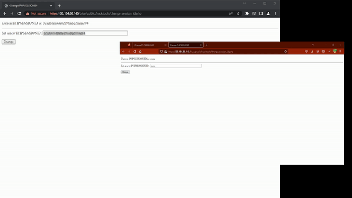
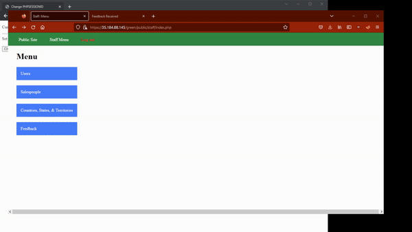
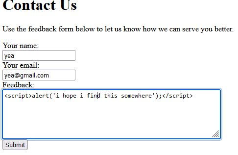
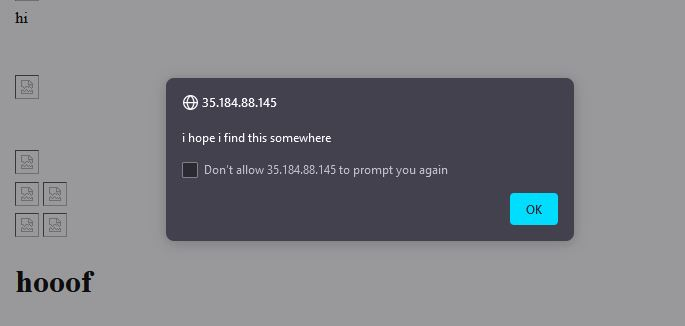
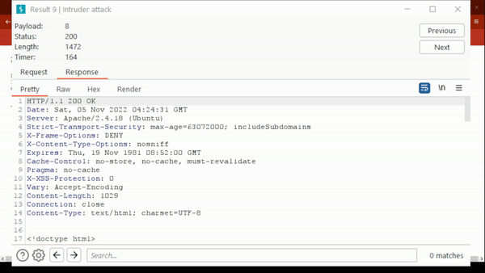

# Pen Testing Live Targets

Time spent: **3** hours spent in total

> Objective: Identify vulnerabilities in three different versions of the Globitek website: blue, green, and red.

The six possible exploits are:

* Username Enumeration
* Insecure Direct Object Reference (IDOR)
* SQL Injection (SQLi)
* Cross-Site Scripting (XSS)
* Cross-Site Request Forgery (CSRF)
* Session Hijacking/Fixation

Each color is vulnerable to only 2 of the 6 possible exploits. First discover which color has the specific vulnerability, then write a short description of how to exploit it, and finally demonstrate it using screenshots compiled into a GIF.

## Blue

Vulnerability #1: Session Hijacking

Description: Using the hacktool to change PHP session IDs, we can use Burp Suite to intercept the attacker's login attempt to modify the session ID to one obtained from a victim. Once changed, the attacker is logged in with the victim's ID.




## Green

Vulnerability #1: Cross-Site Scripting

Description: Users can inject XSS onto the body of a feedback. In here we used ```<script>alert('i hope somebody finds this');</script>``` to bring up an alert every time the feedback page is opened.






## Red

Vulnerability #1: Insecure Direct Object Reference

Description: Modify the ID in the page's URL until we get unauthorized access to an account. Burp Suite was used to make the process a bit automated.




## Notes

I wish the login for the website was displayed somewhere on the project or unit page. Had to scavenge the CodePath course portal to find it at first.

